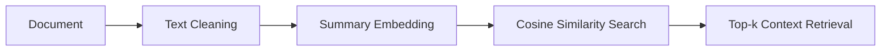

# 🎵 Concert Tour Assistant

A Python service that manages and retrieves concert tour information from documents using RAG (Retrieval Augmented Generation).

## Features

- **Document Ingestion**:
  - Processes plain text files containing tour details
  - Generates concise summaries using BART-large-mnli
  - Validates document relevance (concerts/tours only)

- **Question Answering**:
  - Retrieves tour information (dates, venues, artists)
  - Uses FLAN-T5-base for grounded responses
  - Strictly limits answers to ingested content

- **Streamlit UI**:
  - Clean chat interface
  - Responsive design

---

## Setup Instructions

### Prerequisites
- Python 3.10+
- pip package manager
- More than 5GB free storage space (for models)
- At least 4GB of RAM and modern CPU (for running the models)
- Internet connection

### Repository Structure

```bash
rag-concert-assistant/
├── .streamlit/             # Streamlit configuration
│ └── config.toml
├── core/
│ ├── __init__.py           # Makes the folder a Python package
│ ├── document_processor.py # Document processing and summarization
│ └── rag_system.py         # Vector storage and retrieval
├── tours/                  # Sample tour documents
│ ├── adele.txt
│ │   ...
│ └── kaleo.txt
├── app.py                  # Streamlit web interface
├── main.py                 # Command-line interface
├── .gitignore              # Specifies files to ignore in git
├── requirements.txt        # Dependencies for the project
└── README.md               # This documentation
```

### Key Components

**Core Modules**
- `document_processor.py`: Handles document validation, summarization (using BART-large-mnli), and answer generation (using FLAN-T5-base)
- `rag_system.py`: Manages vectors for document retrieval

**Interfaces**
- `app.py`: Streamlit web UI with chat interface
- `main.py`: CLI version for command-line usage

**Resources**
- `tours/`: Sample concert files for quick testing
- `requirements.txt`: Lists the Python dependencies for this project

---

## How to Use

1. Clone the Repository:

```bash
git clone https://github.com/narekatsy/rag-concert-assistant.git
cd rag-concert-assistant
```

2. Install Dependencies:

```bash
pip install -r requirements.txt
```

3. Run the Project in Command Line Interface

```bash
python main.py
```

Example usage:

```text
> Hi

👋 Hello! I'm your concert tour assistant.
Please add documents using: 'add file: <path>.txt'

> add file: tours/adele.txt

Thank you for sharing! Your document has been successfully added to the database.
Stored documents: 1
Document summary: Tour Name: Unforgettable Musical Journey Tour 2025 Dates: September 12, 2025  Paris, France (Accor Arena) September 18, 2025  Berlin, Germany (Mercedes-Benz Arena) ...

> What is the tour name?

Here's the information from tour documents:
Unforgettable Musical Journey Tour 2025
(Answer is strictly based on ingested documents)

> exit
```

Or, alternatively:

4. Run the Project in Web UI (Streamlit)

```bash
streamlit run app.py
```

Then open `http://localhost:8501` in your browser.

When you are finished, press the `Exit` button and close the browser tab.

---

## Design Choices

### Model Selection & Configuration

| **Component**  | **Choice** | **Rationale** |
|----------------|------------|---------------|
| Summarization   | `facebook/bart-large-mnli`  | Good at extracting key facts from tour schedules |
| Q&A Generation  | `google/flan-t5-base`       | Balanced accuracy/speed for concert queries      |
| Embeddings      | `multi-qa-MiniLM-L6-cos-v1` | Optimized for question-context matching          |
--------------------------------------------------

**Key Decisions**
- Used smaller models to ensure local deployability
- Dynamic summary length based on input size (`input_length * 0.3`)
- Strict prompt engineering to prevent hallucinations

### RAG Pipeline Architecture



**Core Implementation**
- Embedding Model: `multi-qa-MiniLM-L6-cos-v1` (optimized for question-answering)
- Similarity Metric: Cosine similarity (normalized dot product)

### Input Processing and Output Control

**Input processing**

- **Basic text cleaning**: ASCII-only filtering and Whitespace compaction
- **Content Validation**
    - Minimum 50-character length requirement
    - Concert keyword check (≥1 match from 10 terms)
    - File size limit (1MB) and `.txt` extension enforcement
- **Error Handling**
    - Multi-layer try-catch blocks
    - Clear rejection messages (`"Document too short"`)
    - Fallback to raw text when summaries fail

**Output Control**

- Answer grounding by strict prompt template
- Response Formatting
- Error States (distinguished errors displayed)
